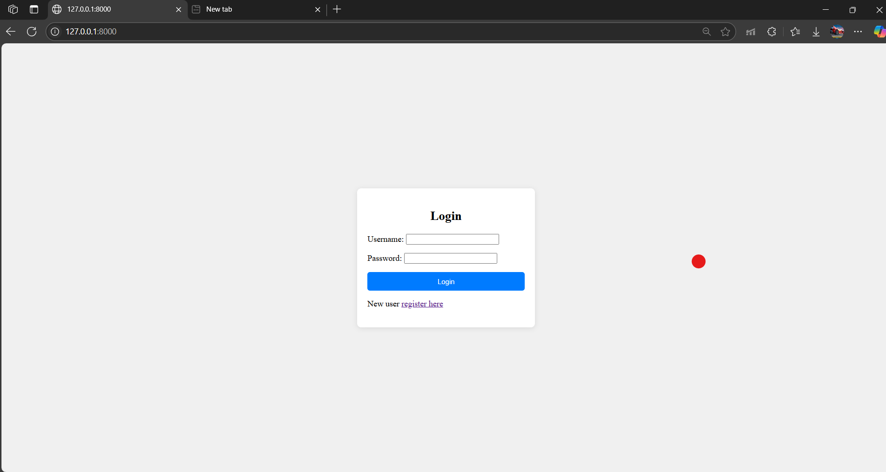
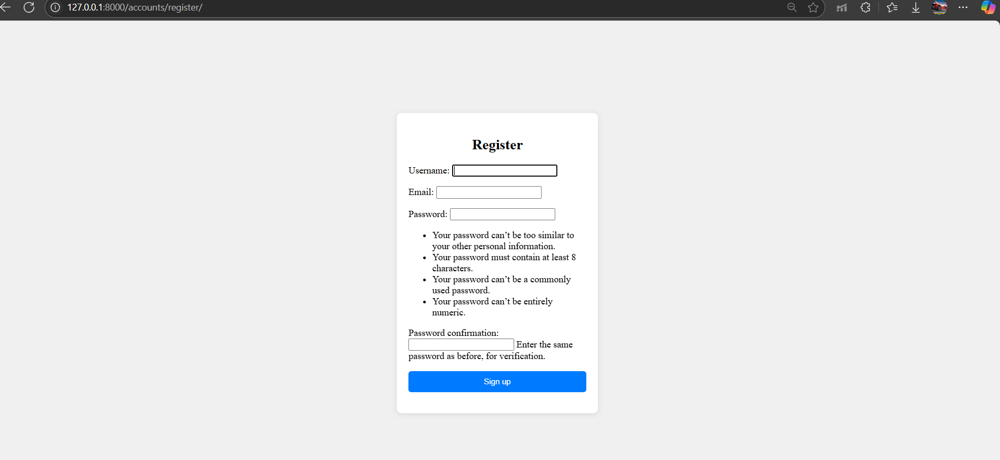
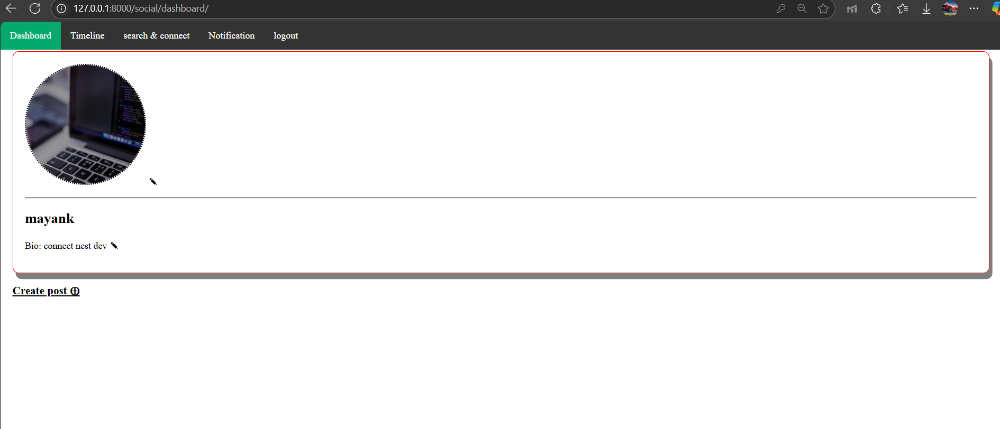
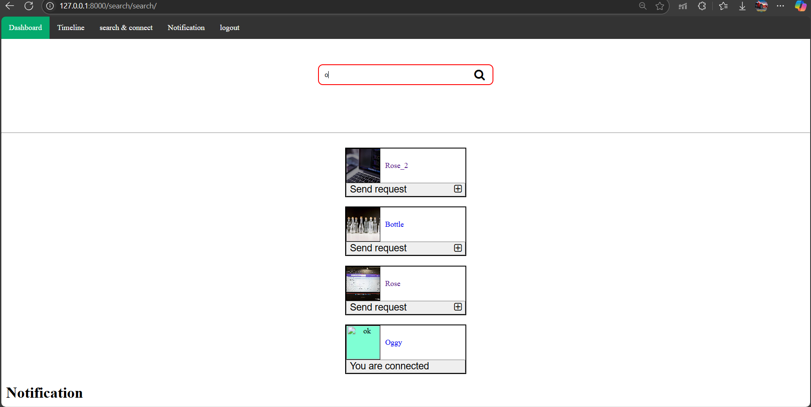
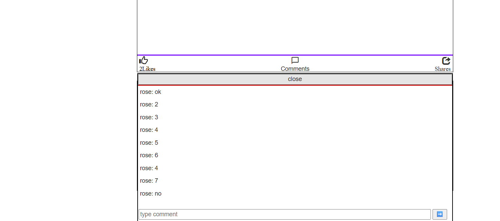
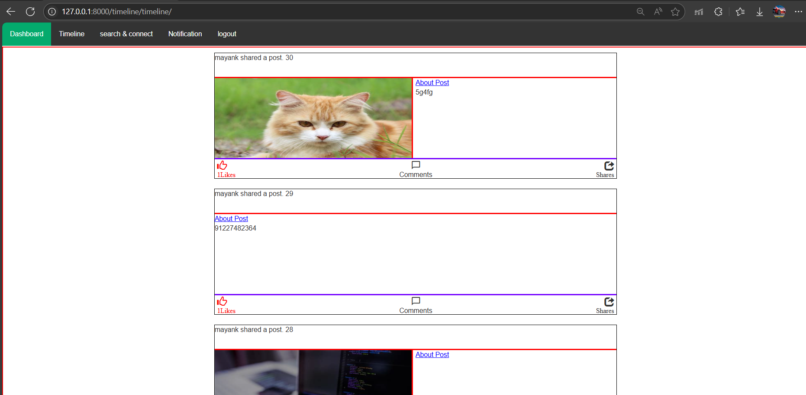
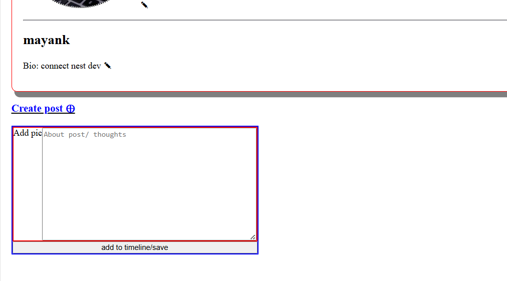
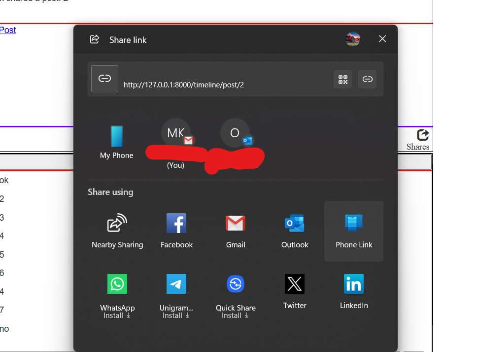
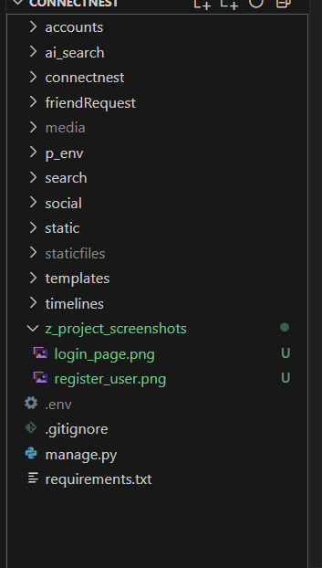

# 🌐 ConnectNest


**ConnectNest** is a Django-based social networking web application where users can connect, share posts, manage friendships, and explore content with a simple and clean interface.

---

## 🚀 Features

- 👤 User Registration & Authentication (Custom Model)
- 🤝 Friend Request System
- 📝 Timeline & Post Sharing
- 💬 Like & Comment Support 
- 🔍 AI-Powered Search *(experimental)*
- 🛠 Django Admin Control Panel
---

---

## 📁 Project Structure
ConnectNest/
├── accounts/ # User login, register, and profile logic
├── ai_search/ # AI search integration (placeholder)
├── friendRequest/ # Sending/receiving friend requests
├── timelines/ # Posting and viewing timelines
├── social/ # Project-level settings and routing
├── templates/ # HTML frontend templates
├── static/ # CSS, JS, and images
├── manage.py # Django project entry point
└── requirements.txt # List of Python dependencies


---

## 🛠️ Installation Guide

Follow these steps to run the project locally:

### 1. Clone the Repository

```bash
git clone https://github.com/mkkotlin/ConnectNest.git
cd ConnectNest

python3 -m venv venv
source venv/bin/activate        # Linux/macOS
venv\Scripts\activate           # Windows

pip install -r requirements.txt
python manage.py migrate
python manage.py createsuperuser
python manage.py runserver
Visit: http://127.0.0.1:8000
```


🧪 Testing & Usage
Register a user or login

Try posting to the timeline

Send/accept friend requests

Explore the admin panel at /admin/

---

## 📬 Contributing
Pull requests are welcome! If you’d like to help:

Fork the repo

Create a feature branch (git checkout -b feature/your-feature)

Commit your changes

Push to your fork

Open a pull request 🚀


## 👤 Author
GitHub: @mkkotlin
📬 Feel free to connect for feedback, ideas, or collaboration!


> ✅ **Screenshots**


## 🖼️ Preview

### 🔐 Login Page


### 📝 Register Page


### 👤 Dashboard / Profile Page


### 🔍 Search & Notifications


### 🧾 Notification Requests


### 🗨️ Comment Box


### 📰 Timeline View


### ➕ Create Post


### 🔗 Share Feature


### 📁 Project Directory Structure

